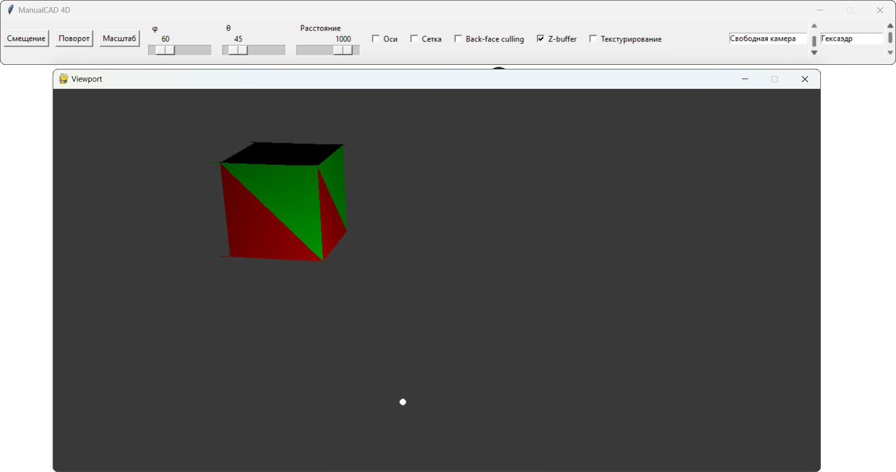
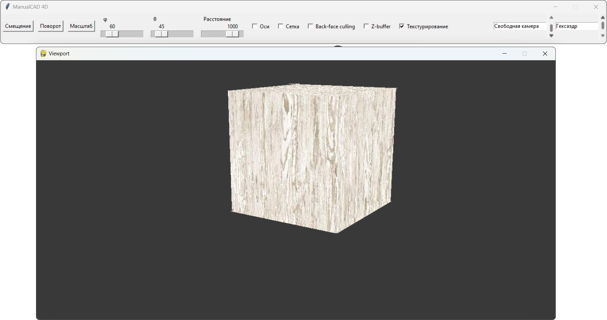
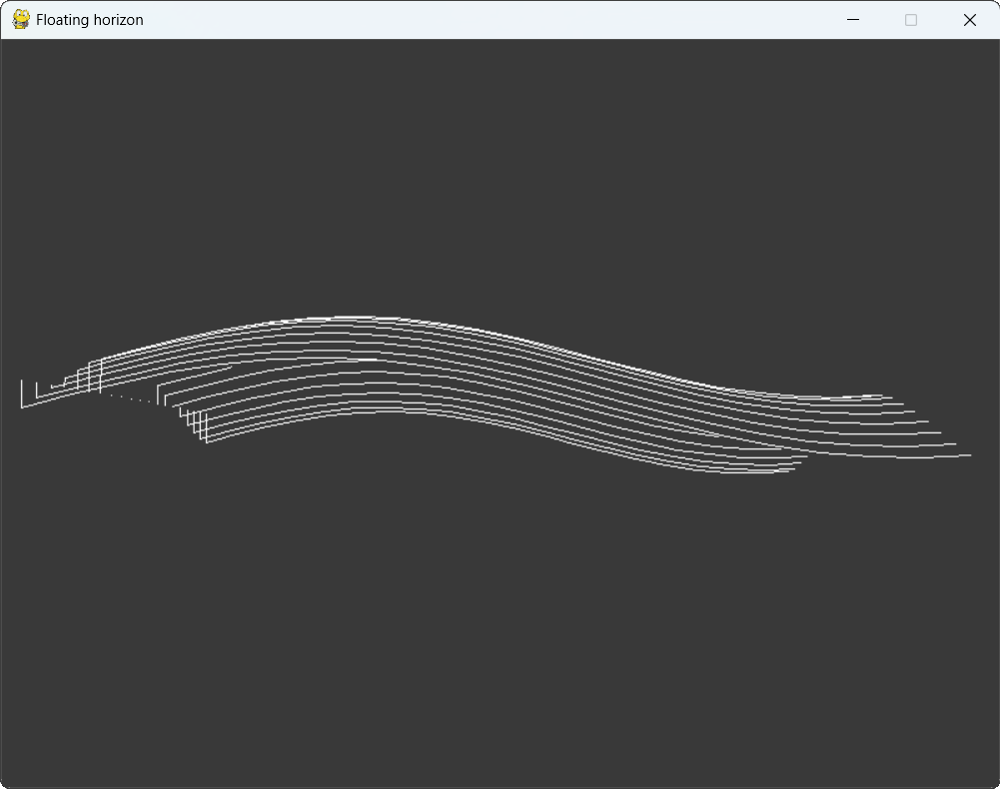

# Лабораторная работа № 9. Освещение и текстурирование
## Задание
### 1. Освещение
Реализовать метод Гуро для затенения фигур. (например, для кубика, удаляя нелицевые грани)
- Добавить нормаль к каждой вершине.
- Добавить положение источника света и цвет объекта.
- Вычислить цвет в каждой вершине по модели Ламберта (рассеянную часть).
- Закрасить грань, интерполируя цвет между цветами вершин (билинейная интерполяция).
- Добавить возможность применения аффинных преобразований к объекту.
### 2. Текстурирование
Реализовать алгоритм наложения текстуры на полигон. (например, для кубика, удаляя нелицевые грани)
- Добавить координаты текстуры к каждой вершине.
- При отрисовке грани интерполировать координаты текстуры между координатами вершин.
- Продемонстрировать текстурирование на правильных многогранниках -(тетраэдр, куб, октаэдр).
- Добавить возможность применения преобразований к объекту.
### 3. Метод плавающего горизонта
- Построить проекцию графика функции 2-х переменных: по алгоритму плавающего горизонта.
- Реализовать отображение линиями или сеткой или треугольниками.
- Добавить возможность менять направление обзора.
## Демонстрация работы

